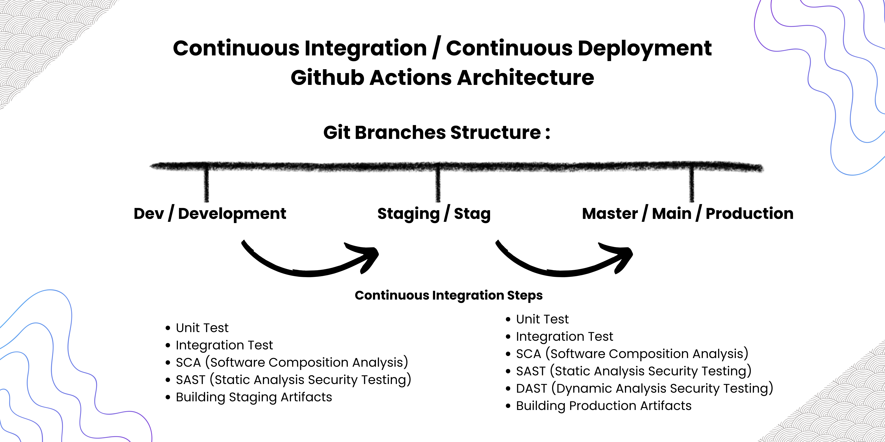

# DevSecOps Tools Continuous Integration with Github Actions and Docker Container for Go-Lang

This repository is a simple project or guide for the implementation of Security in DevSecOps (Development - Security - Operation) practices and emphasizes more on the practical implementation of CI (Continuous Integration) Security such as SCA, SAST, DAST with tools / libraries that have been provided in each programming language used.

> ! Additional Information : This repository only implements Continuous Integration without Stage Test, and CI is only implemented in Go-Lang projects.

The following is an explanation of each stage in CI (Continuous Integration) in DevSecOps practice:

- **Unit Test (Test Stage)** : In CI (Continuous Integration) Unit Test is a source code testing stage that tests each function available in the code, whether the function runs according to the expected results expected by QA with custom parameters.

- **Integration Test (Test Stage)** : Integration Test is a fairly important testing stage because a test is based on a case study such as Login which requires several other functions that are bound together so this process is quite slow, but with this test QA can ensure that whether an application flow can run well or not.

- **SCA / Sofware Composition Analysis (Security)** : Software Composition Analysis is a very important stage in CI, in this stage the quality of vulnerability / security of a package dependency of our application is tested. In project go we can usually utilize `govulncheck` to test the vulnerability level of installed dependencies to avoid application exploitation from external dependencies. For more details you can see [here](https://github.com/HaikalRFadhilahh/go-ci-devsecops/tree/master/govulncheck)

- **SAST / Security Analysis Security Testing (Security)** : SAST is the Security stage of testing where we test the vulnerability level of our project code without running our go project. In go-lang we can utilize the `gosec` package/library to test the vulnerability of our go code. For more information and how to use it can be seen [here](https://github.com/HaikalRFadhilahh/go-ci-devsecops/tree/master/gosec)

- **DAST / Dynamic Analysis Security Testing (Security)** : DAST is a stage of testing applications by simulating attacks on our running applications. After simulating the attack the tools used will provide results that we can evaluate whether there are gaps that must be corrected. To make DAST there are tools that we can use, for example _Owasp Zap Baseline_ and to do DAST our application must run first, usually testing will be directed / targeted to the testing / staging environment.

- **Build Source / Building Artifacts** : Building Artifacts is a stage where the application is built in a form that is ready to be deployed on CD (Continuous Deployment / Delivery). Artifacts Build / Artifacts Application can be in the form of binary code (Usually C++, C, Go App) or Docker Image that has been uploaded to a container registry such as (Github Container Registry, Docker Hub, Private Container Registry).

## Basic Understanding and Flow of Continuous Integration Implementation on Github Actions

In this section I will explain how to implement Continuous Integration in Github Actions. Like the use of CI stages and branch structures, in this project or guide I use 3 branches namely `main / master` which is the main branch or source code for production, `staging` which functions for testing and the application that runs here has a different url from prod for DAST testing and the last is `development` is a branch for developers to save code changes and will be shifted to `staging` if they want to publish but are being tested by QA.

To clarify the CI / Continuous Integration process that is implemented I have created a picture that can be understood. Here is the CI Process Image:



Based on the picture above, there are 2 CI / Continuous Integration processes, namely from dev to stag and stag to prod / master. Here's a further explanation of the 2 differences:

- **`development` -> `staging`** : In the CI process at the `development` -> `staging` stage there are several stages that are usually applied such as Project Testing (However, this time I did not exemplify the Testing stage in CI), checking the libraries that have just been installed into the project using the SCA technique and analyzing the new source code using SAST. Then besides that we also have to upload the Artifact / Deployment to the staging server / Trigger the External Tools CD.

- **`staging` -> `production`** : In the CI process, the `staging` -> `production` stage is quite crusial and important because there are several additional options, namely the implementation of DAST (Dynamic Analysis Security Testing) in CI to production. But besides that we still have to implement SCA, SAST, and Testing like CI Dev to Staging.

  <br>

  > In CI Production, the Target from DAST (Dynamic Analysis Security Testing) URL is redirected to the Staging URL and make sure it passes the test to enter the production server.

  <br>

## Continuous Intergation Implementation on Github Actions

This section focuses more on how to implement a DevSecOps CI according to the DevSecOps Gospel rules. Although there are many steps in the CI Github Actions File below, we mostly talk about SCA, SAST, DAST according to the original purpose of this documentation. For reference you can see an example of Continuous Integration DevSecOps with Github Actions below:

> ! It should be noted that in the Continuous Integration File there is Deployment and Testing, but here it is only a reference and can be used according to the conditions of your project needs.

```yaml
# Configure Name of Continuous Intergation File
name: Continuous Integration DevSecOps from Development to Staging

# Condition
on:
  # Running when Pull Request to Staging Branches
  pull_request:
    branches:
      - staging
      - master
  # And Running Pipeline when Pushed to Staging Branches
  push:
    branches:
      - staging
      - master

# List Of Jobs Pipeline / Contionous Integration
jobs:
  # Jobs For Unit Test
  unit-test:
    # Running Jobs with Ubuntu OS
    runs-on: ubuntu-latest

    # Run Jobs when Pull Request to Staging
    if: github.event_name == 'pull_request'

    # List Steps of Jobs
    steps:
      - name: Checkout Code / Copy Source Code to Jobs Runner
        uses: actions/checkout@v4

      - name: Unit Testing Script / Command
        run: echo "Run Your Unit Test Script Here"

  # Jobs For Integration Test
  integration-test:
    # Running Jobs with Ubuntu OS
    runs-on: ubuntu-latest

    # Run Jobs when Pull Request to Staging
    if: github.event_name == 'pull_request'

    # List Steps of Jobs
    steps:
      - name: Checkout Code / Copy Source Code to Jobs Runner
        uses: actions/checkout@v4

      - name: Integration Testing Script / Command
        run: echo "Run Your Integration Test Script Here"

  # Jobs For Software Composition Analysis
  sca:
    # Running Jobs with Ubuntu OS
    runs-on: ubuntu-latest

    # Run Jobs when Pull Request to Staging
    if: github.event_name == 'pull_request'

    # List Steps of Jobs
    steps:
      - name: Checkout Code / Copy Source Code to Jobs Runner
        uses: actions/checkout@v4

      - name: Pull Docker Images govulncheck for SCA
        run: docker pull ghcr.io/haikalrfadhilahh/govulncheck:1.1.4

      - name: SCA Scan with govulncheck with docker
        run: docker run --rm -v $(pwd):/app ghcr.io/haikalrfadhilahh/govulncheck:1.1.4 govulncheck -scan symbol -mode source -show color,traces,version -format text ./... | tee -a result-govulncheck.txt
        continue-on-error: true

      - name: Upload Result SCA Test with Github Actions Artifacts
        uses: actions/upload-artifact@v4
        continue-on-error: true
        with:
          name: govulncheck SCA Test Result
          path: result-govulncheck.txt

  # Jobs For SAST (Static Analysis Security Testing)
  sast:
    # Running Jobs with Ubuntu OS
    runs-on: ubuntu-latest

    # Run Jobs when Pull Request to Staging
    if: github.event_name == 'pull_request'

    # List Steps of Jobs
    steps:
      - name: Checkout Code / Copy Source Code to Jobs Runner
        uses: actions/checkout@v4

      - name: Pull Docker Images govulncheck for SAST
        run: docker pull ghcr.io/haikalrfadhilahh/gosec:2.22.4

      - name: SAST Security Testing with gosec with docker
        run: docker run --rm -v $(pwd):/app ghcr.io/haikalrfadhilahh/gosec:2.22.4 gosec -stdout -sort -severity medium -nosec -fmt text -color -confidence medium -out /app/result/result-gosec.txt ./...
        continue-on-error: true

      - name: Upload Result SAST Test with Github Actions Artifacts
        uses: actions/upload-artifact@v4
        continue-on-error: true
        with:
          name: gosec SAST Test Result
          path: result/result-gosec.txt

  # Jobs for DAST (Dynamic Analysis Security Testing) using Zaproxy Baseline
  dast:
    # Running DAST Jobs with ubuntu os
    runs-on: ubuntu-latest

    # Setting Environtment
    environment: staging

    # Running Jobs when
    if: ${{ github.event_name == 'pull_request' && github.base_ref == 'master' }}

    # List of Steps
    steps:
      - name: Pull Docker Image Owasp Baseline
        run: docker pull zaproxy/zap-stable:2.16.1

      - name: DAST Scan with Owasp Baseline
        run: docker run -u root --privileged -v $(pwd):/zap/wrk:rw --rm zaproxy/zap-stable:2.16.1 zap-baseline.py -t ${{ secrets.URL_APP_STAGING }} -w result-zaproxy-baseline.md
        continue-on-error: true

      - name: Upload Result DAST Test with Github Actions Artifacts
        uses: actions/upload-artifact@v4
        continue-on-error: true
        with:
          name: Zaproxy Baseline DAST Test Result
          path: result-zaproxy-baseline.md

  # Jobs for Deployment in Staging Stage
  deploy-staging:
    # Running Jobs Deployment Staging in Ubuntu OS
    runs-on: ubuntu-latest
    # Running Jobs when Success Merged on Staging
    if: ${{ github.event_name == 'push' && github.ref == 'refs/heads/staging' }}

    # List of Steps
    steps:
      - name: Build Docker Image Staging Artifacts
        run: echo "Run Command / Script to Build you App Docker Artifacts"

      - name: Push Docker Image Staging To Registry
        run: echo "Run Command / Script to Push / Upload your App Artifact / Image to Registry"

  # Jobs for Deployment in Production Stage
  deploy-production:
    # Running Jobs Deployment Production in Ubuntu OS
    runs-on: ubuntu-latest
    # Running Jobs when Success Merged on Staging
    if: ${{ github.event_name == 'push' && github.ref == 'refs/heads/master' }}

    # List of Steps
    steps:
      - name: Build Docker Image Production Artifacts
        run: echo "Run Command / Script to Build you App Docker Artifacts"

      - name: Push Docker Image Production To Registry
        run: echo "Run Command / Script to Push / Upload your App Artifact / Image to Registry"
```

The code above is a file that contains code for Continuous Integration in all branches. By using `if` in jobs we can set when and whether a job is run under certain conditions so that it can summarize jobs neatly.

> Additional Information: There are many ways to declare CI Pipeline in Github Actions. If you follow the tutorial above then I only declare ci in one file. But if you don't like that concept you can change the code and break it into several part files.

> Warning: If you have variables / values that are confidential you can store in the repository in the form of secrets / vars. You can read the tutorial at this [link](https://docs.github.com/en/actions/security-for-github-actions/security-guides/using-secrets-in-github-actions)

## References

- SCA (Software Compsition Analysis) with govulncheck : [govulncheck docker image documentation](https://github.com/HaikalRFadhilahh/go-ci-devsecops/tree/master/govulncheck)
- SAST (Static Analysis Security Testing) with gosec: [gosec docker image documentation](https://github.com/HaikalRFadhilahh/go-ci-devsecops/tree/master/gosec)
- DAST (Dynamic Analysis Security Testing) with zaproxy baseline : [zaproxy baseline docker documentation](https://hub.docker.com/r/zaproxy/zap-stable)

## Contributors

You can contribute to this project via Pull Request to this Repository, or you can report bugs, vulnerabilities, misinformation via the issues feature on github. 🐳

## <!-- Footer End Of The README Markdown -->

<p align="center"><b>Created By Haikal and Contributors with ☕️ and ❤️ </b></p>
